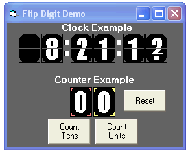



## FlipDigits\_Usercontrol

### Description

Simulates the digits on a flip type clock. Use to build a clock or use as a counter. Nothing really new here,was just trying my hand at making the graphics.If you have a use for this project, great!
 
### More Info
 

             |
---                |---
**Submitted On**   |2007-08-25 08:18:02
**By**             |[Kenneth Foster](https://github.com/Planet-Source-Code/PSCIndex/blob/master/ByAuthor/kenneth-foster.md)
**Level**          |Intermediate
**User Rating**    |4.7 (28 globes from 6 users)
**Compatibility**  |VB 6\.0
**Category**       |[Custom Controls/ Forms/  Menus](https://github.com/Planet-Source-Code/PSCIndex/blob/master/ByCategory/custom-controls-forms-menus__1-4.md)
**World**          |[Visual Basic](https://github.com/Planet-Source-Code/PSCIndex/blob/master/ByWorld/visual-basic.md)
**Archive File**   |[FlipDigits2080688252007\.zip](https://github.com/Planet-Source-Code/kenneth-foster-flipdigits-usercontrol__1-69206/archive/master.zip)

